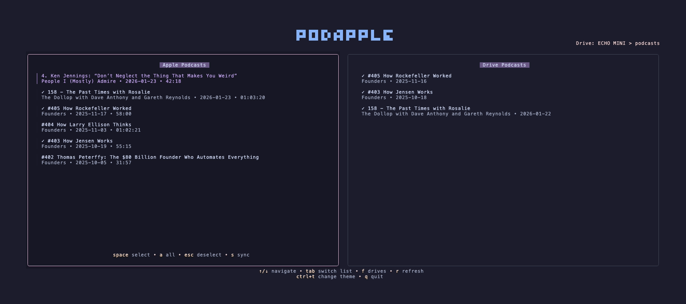

# 🍎 Podapple

A modern, terminal-based Apple Podcasts synchronizer built for speed and simplicity.



**Note: This application is specifically designed for macOS.**

## Features

- 🖥️ **TUI Interface**: Full terminal user interface using `@opentui`.
- ⚡ **Fast**: Built on the Bun runtime.
- 🔄 **Syncing**: Seamlessly sync selected episodes to external drives (e.g., Apple iPods or MP3 players).

## Syncing with Drives

`Podapple` includes a powerful sync engine designed to manage your Podcast library:
- **Automatic Detection**: Scans and identifies compatible external drives.
- **Smart Metadata**: Automatically tags synced files with correct podcast metadata (Title, Artist, Album).
- **Sanitization**: Ensures filenames and directory structures are compatible with standard MP3 player filesystems.
- **Progress Tracking**: Real-time feedback on transfer speeds, byte counts, and remaining files.

## Getting Started

### Prerequisites

- **macOS**
- [Bun](https://bun.sh)

### Installation

#### Homebrew

```bash
brew tap joncrangle/tap
brew install podapple
```


#### Binary

Download a prebuilt binary for Apple Silicon (aarch64) or Intel Mac (x86_64) from the [latest release](https://github.com/joncrangle/podapple/releases).

## Development

To get started with local development:

```bash
git clone https://github.com/joncrangle/podapple.git
cd podapple
bun install
just start
```

This project uses [`just`](https://github.com/casey/just) as a command runner:

```bash
just --list       # Show all commands
just test         # Run tests
just lint         # Lint code
just check        # Type check
just build        # Build for production
```

## Tech Stack

- **Runtime**: [Bun](https://bun.sh)
- **Language**: [TypeScript](https://www.typescriptlang.org/)
- **UI Framework**: [SolidJS](https://github.com/solidjs/solid) + [OpenTUI](https://github.com/anomalyco/opentui)
- **Logic & Effects**: [Effect TS](https://github.com/effect-ts/effect)
